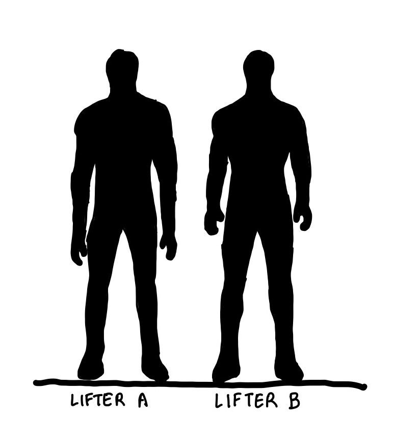
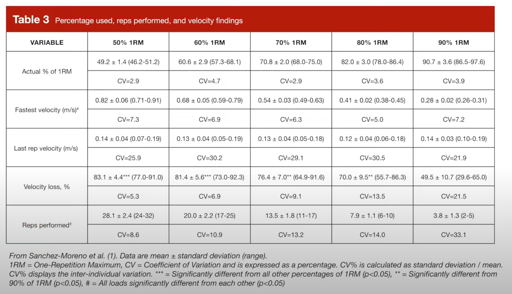
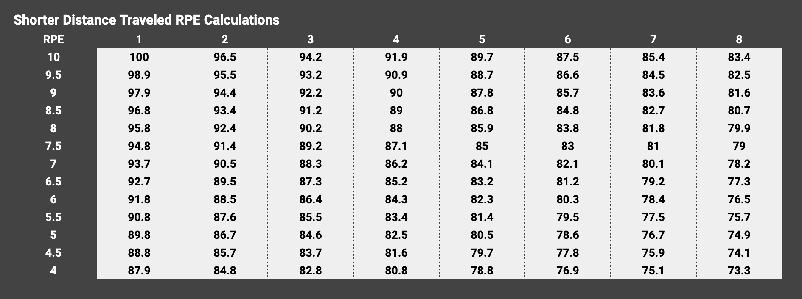
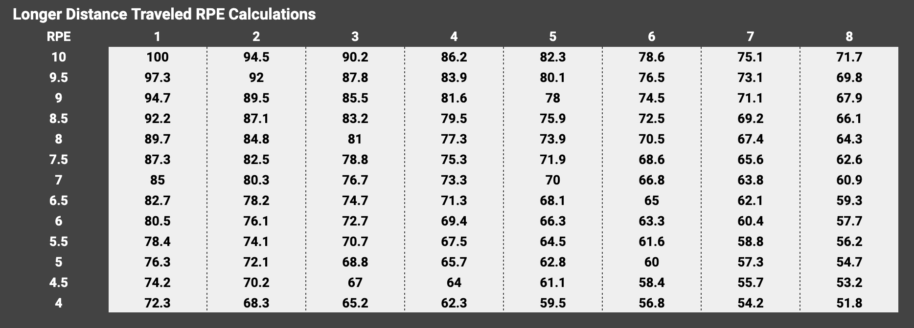
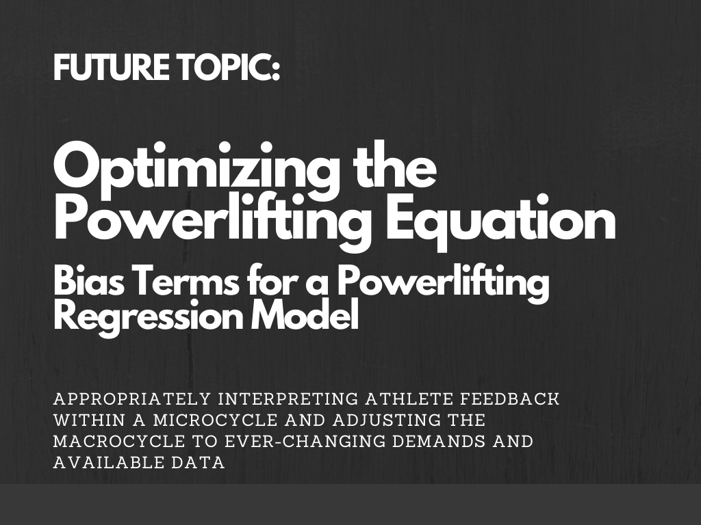

# Optimizing the Powerlifting Equation
# Part 1: Physics I: Interpreting Work

## Distance Traveled
The fundamentals of this topic have already been covered extensively by Steve DeNovi in his video “The Effect of Distance Traveled on Programming,” which I believe to be an essential watch for any powerlifting coach. However it still must be addressed here at least as a baseline in order for future topics on “Optimizing the Powerlifting Equation” to be properly contextualized. 

We begin with a discussion about one of the first topics discussed in an introductory Physics course: Work. A scientific definition is that Work is the amount of energy expended in applying a force to move an object. Further extrapolation of this definition to powerlifting isn’t very challenging. The equation for work is simply force multiplied by a distance and subsequently from here we will mostly expand upon and isolate this distance variable. 

## Addressing Individual Variation
Within strength training, it is well understood there is huge variation when it comes to range of motion and thus distance traveled when it comes to performing individual repetitions. 

There are many factors that lead to these difference in distance traveled between different athletes and even for each individual athlete. Anatomical factors such as height, bodyweight, and limb lengths intuitive make sense. Lets consider the deadlift, Lifter A, who is significantly taller than Lifter B, most likely will have to move the barbell further than Lifter B in order to complete the rep. 

Continuing with deadlift, we present another example where Lifter A and Lifter B are the same height. However Lifter A, who has significantly longer arms than Lifter B, will most likely move the barbell a much less distance than Lifter B in order to complete a rep. 

In a more powerlifting-specific case, taking bench for example, athletes with a higher arch typically have a lower distance that they have to move the weight than a lifter with minimal or no arch. And for many, sumo deadlifters typically will enjoy lower distance traveled than conventional deadlifters.  

## Why Does This Matter?
However are these considerations really that important when it comes to either programming or understanding how to optimize your movement system? And even if it was important, how could you concretely quantify these individual differences in an athlete-by-athlete basis?

## Quantifying Specific Inter-Individual Variability
To address these concerns, we turn to a study by Moreno et al. I have included its information, including its DOI on the screen. 

The study intended to quantify the specific inter-individual variability in maximal number of repetitions performed against a specific load which corresponded to a percentage of their 1 repetition maximum. The authors additionally examined velocity loss magnitude in relation to percentage of completed repetitions but this will not be the focus of this discussion.

## Visualizing Repetition and Percentage Range Variability
So now we move to interpret the findings of the study. This table summarizes the findings succinctly and thus allows us to easily interpret what the authors found. For us, the primary row of interest is the Reps performed row. The reps performed correspond to 50,60,70,80,and 90% of 1 rep max respectively.

It is obvious that the amount of maximum repetitions between individuals varies wildly. One the lower end of the spectrum, 60% of 1 rep max saw lifters perform anywhere between 17-25 reps. This means that one person could do 25 reps using 60% of their 1 rep max while someone else could only do 17 reps using the same 60% of their 1 rep max. And this difference can mostly be explained by the individual differences discussed earlier, whether it be differences in leverages, body structure, or even technical expression.

The 90% benchmark is very interesting as its conventionally seen as the average percentage (approximately 89.2%) for a single at RPE 7 (or understood as 3 reps in reserve). However this study demonstrates that participants performed between 2-5 reps, meaning that 90% of an individual’s 1 rep max could be as difficult as being their 2 rep max while for others being as easy as being their 5 rep max.

This study gives us tangible research data about the distribution of individual leverages and concretely establishes how to interpret programmed volume on a by-individual basis, as volume is just a summation of work done. However we still want to be able to apply this data in order to affect our programming philosophy as powerlifting coaches.

## Updating the RPE-Percentage Table
We want to be able to visualize the data from the study we discussed in the previous slide, preferably in a format familiar to most powerlifting coaches: the conventional RPE to percentage chart. So here I provide updated RPE tables, extrapolated from the study’s data by Steve DeNovi. The full tables can be found in his video “The Effect of Distance Traveled on Programming." 

Here they are presented in regards to RPE and corresponding percentages given perceived distanced traveled, which is a combination of the individual factors detailed earlier. At the end of the day, how favored a lifter is within certain rep ranges, and the true distance traveled within repetitions performed, comes down to the personal expertise and opinion of their coach.

These tables simply form a baseline in being able to visualize the extremes of percentage-based programming for understanding 1RM. However I am not the biggest fan of implementing these tables as a sole reference in programming for my clients. These updated tables only serve as an additional tool in referencing both the lower and upper limits of percentage-based programming. 

And this will be a topic that I plan to address in the future. How to appropriately utilize athlete feedback within a microcycle to adjust their macrocycle as data becomes increasingly available as well as through ever-changing individual demands. 

## Conclusion
In conclusion, although this knowledge of individuality, distance traveled, and gaining an updated perspective on the RPE-percentage relationship is important, all of this just serves as additional tools in truly optimizing individualized powerlifting programming. And further expanding on the two updated RPE charts, the percentages provided will apply to almost no one as they are just that extreme. However establishing what the limits of the extremes are is of itself an incredibly powerful tool.
